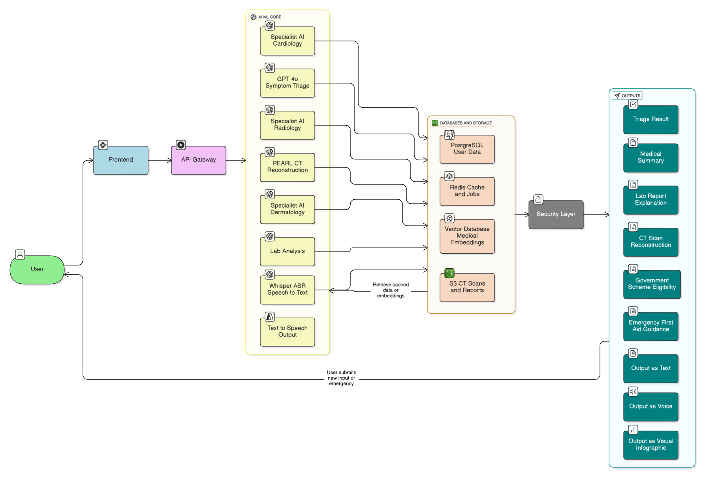
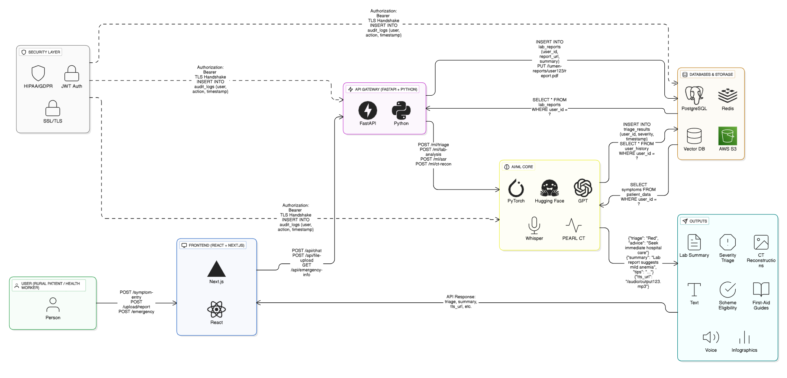

# LUMEN - Localized Unified Medical Engine for Triage

A modern, multilingual, AI‑powered healthcare assistant designed for India. LUMEN integrates triage, specialist guidance, PEARL CT reconstruction, lab report analysis, government scheme discovery, emergency education, and specialized women's health modules into a single, accessible product.

> Disclaimer: LUMEN is a research prototype and does not replace professional medical advice.

## Table of Contents

- [Problem Statement](#problem-statement)
- [Proposed Solution](#proposed-solution)
  - [Normal Features](#normal-features)
  - [Unique Differentiators ](#unique-differentiators-student-innovation)
- [Role of OpenAI Tools](#role-of-openai-tools)
- [Tech Stack](#tech-stack)
- [User Flow](#user-flow)
- [System Architecture](#system-architecture)
- [Impact](#impact)
- [Local Development](#local-development)
- [References (IEEE‑style)](#references-ieee-style)

---

## Problem Statement

How do we ensure that rural women and families get timely, affordable, and reliable healthcare? Why are preventable deaths still common in villages despite government schemes and technology progress?

India's rural healthcare system faces critical gaps that result in preventable deaths, untreated conditions, and rising costs.

### Limited Access & Workforce Shortage

- Over 900 million rural residents (65% of the population) face inadequate infrastructure, with 16% fewer PHCs and 50% fewer CHCs than required
- Shortages are severe: 8% PHCs lack doctors, 38% lack lab technicians, and workforce density is 20.6 per 10,000, far below the WHO norm of 44.5
- Doctor/nurse/midwife density is 20.6 per 10,000 vs WHO recommendation 44.5 per 10,000

### Emergency Care Deficiencies

- Snakebites alone cause 58,000 deaths annually, 70% in rural areas where delays and lack of first-aid knowledge prevail
- Many victims first turn to traditional healers, worsening outcomes

### Women's Health & Menstrual Hygiene Gaps

India's rural healthcare system faces critical gaps that result in preventable deaths, untreated conditions, and rising costs.

### Limited Access & Workforce Shortage

- Over 900 million rural residents (65% of the population) face inadequate infrastructure, with 16% fewer PHCs and 50% fewer CHCs than required
- Shortages are severe: 8% PHCs lack doctors, 38% lack lab technicians, and workforce density is 20.6 per 10,000, far below the WHO norm of 44.5
- Doctor/nurse/midwife density is 20.6 per 10,000 vs WHO recommendation 44.5 per 10,000

### Emergency Care Deficiencies

- Snakebites alone cause 58,000 deaths annually, 70% in rural areas where delays and lack of first-aid knowledge prevail
- Many victims first turn to traditional healers, worsening outcomes

### Women's Health & Menstrual Hygiene Gaps

- Disorders like PCOS (6–10% prevalence) and endometriosis remain underdiagnosed, with low awareness in rural India
- Only 42–43% of adolescent girls use hygienic menstrual products; poor practices increase risk of infections
- Stigma and taboos limit discussion and treatment, while awareness of government schemes like MHS and Jan Aushadhi remains low, adding travel and wage-loss costs for women

These gaps result in avoidable morbidity, mortality, and economic strain, while existing policies remain fragmented and underutilized. A holistic, context-aware intervention is urgently needed.

## Proposed Solution

LUMEN: a multilingual, voice‑first, AI assistant tailored for India, integrating high‑impact modules to bridge access, knowledge, and diagnostics.

### Normal Features

1. **Symptoms‑Based Diagnosis & Guidance**
   - Accepts multimodal inputs (text/audio/image).
   - Analyzes reported symptoms and provides a probable diagnosis with severity categorization (Green/Yellow/Red).
   - Offers clear next-step guidance (home care, clinic visit, or emergency attention), along with easy-to-follow instructions in voice, text, and visual formats.

2. **AI Specialist Modules**
   - Dermatology, Radiology, Cardiology, etc., offering diagnostic suggestions from multimodal inputs.
   - Provides both patient-friendly advice and clinician-level summaries.

3. **Multilingual Voice‑First Chatbot**
   - Supports five Indian languages.
   - Uses Whisper for ASR and GPT for natural, empathetic explanations.

### Unique Differentiator Features

1. **PEARL Integration - Personalized Estimated Anatomic Reconstruction & Lifecare**
   - A local, hybrid CT reconstruction engine combining geometry-aware modeling (PerX2CT), diffusion refinement (XctDiff), and NeRF detail polishing (SAX-NeRF).
   - Generates estimated CT volumes with voxel-level uncertainty, enabling safer, lower-dose imaging for follow-up.

2. **Lab Report Analyzer & Follow‑Up Generator**
   - Parses uploaded lab reports (PDF/image), compares values with age- and sex-specific reference ranges, flags abnormalities, and generates simple explanations with diet/lifestyle advice.
   
   **Example:**
   - Input (Lab Report): 30-year-old female, Hemoglobin 9.8 g/dL (Normal: 12.0–15.5), RBC 3.6 million/µL (Normal: 4.2–5.4).
   - Output (System): "Your blood count is lower than normal, which may cause tiredness. Eat iron-rich foods such as spinach, dal, jaggery, and vitamin C fruits. Please consult a doctor if you feel weak or if levels fall further."
   - Severity tier: Moderate — follow-up within 1–2 weeks.

3. **Government Schemes & Benefits Assistant**
   - Retrieves up-to-date national and state health schemes from a knowledge base and explains eligibility + steps in local language.
   
   **Example:**
   - Input (User Query): "My father in Uttar Pradesh needs dialysis - is there any government help?"
   - Output (System): "Yes. Under Ayushman Bharat – PMJAY and the UP State Health Scheme, eligible patients get free dialysis at government hospitals. Carry Aadhaar and Ayushman Bharat card to the hospital registration desk. You can also call 14555 for support."

4. **Preliminary Triage & Emergency Education**
   - Offers step-by-step, life-saving instructions for common emergencies where delays cost lives - such as snakebite, drowning, burns, or electric shock.
   - Provides clear voice, text, and visual guidance in local language (e.g., CPR steps, immobilization after snakebite, "stop-drop-roll" for fire injuries).
   
   **Example:**
   - Input: "A child has stopped breathing after drowning."
   - Output: "Call for emergency help immediately. Lay the child flat, check breathing. If not breathing, start CPR: 30 chest compressions, 2 rescue breaths. Continue until medical help arrives."

5. **GynaeCare - Specialized Women's Health Module**
   - **Symptom Screening & Awareness**: Private Q&A to flag possible issues like PCOD/PCOS (irregular cycles, acne, hormonal imbalance) and Endometriosis (severe pelvic pain, painful periods).
   - **Guided Next Steps**: Early red-flag alerts on when to seek medical help, plus low-cost self-care tips (diet, activity, stress management).
   - **Sanitation & Hygiene Education**: Safe use of cloth pads, menstrual cups, biodegradable pads, with proper disposal methods (ash pits, eco-friendly options).
   - **Govt Schemes & Support**: Links to Jan Aushadhi (affordable medicines), Menstrual Hygiene Scheme (MHS), and connects users with local ASHA/anganwadi workers.

## Role of OpenAI Tools

| LUMEN Feature             | OpenAI Model                         | Usecase                                                                                                  |
| ------------------------- | ------------------------------------ | -------------------------------------------------------------------------------------------------------- |
| Symptom Triage & Guidance | gpt-4o                               | Provides empathetic triage and severity classification from patient symptoms                             |
| AI Specialist Summaries   | gpt-4o-mini                          | Summarizes AI-ML Model outputs into doctor-style report                                                  |
| Lab Report Analyzer       | gpt-4o                               | Interprets OCR lab values and explains results in patient-friendly terms                                 |
| Govt Schemes Assistant    | text-embedding-3-small + gpt-4o-mini | Retrieves and explains govt health scheme eligibility in simple language                                 |
| Emergency Protocols       | gpt-4o-mini                          | Gives fast, step-by-step emergency medical instructions                                                  |
| Voice Input (ASR)         | whisper-1                            | Converts patient speech to text for symptom entry                                                        |
| Voice Output (TTS)        | gpt-4o-audio/Azure TTS               | Delivers AI responses as a natural voice for accessibility                                               |
| Chatbot                   | gpt-4o                               | Provides 24/7 conversational support, guiding users across triage, lab results, schemes, and emergencies |

## Tech Stack

### Detailed Technology Breakdown

| Layer                   | Tech                                                                       | Use                                                                                                          |
| ----------------------- | -------------------------------------------------------------------------- | ------------------------------------------------------------------------------------------------------------ |
| Frontend                | React (TypeScript), Next.js, Tailwind CSS                                  | Multilingual, responsive web UI for symptom input, lab uploads, CT viewing, chatbot; SSR for speed & SEO     |
| Backend                 | FastAPI                                                                    | High-performance backend framework; implements REST API endpoints for frontend and AI/ML model communication |
| Primary DB              | PostgreSQL                                                                 | Stores user profiles, triage history, lab values, CT metadata, government scheme eligibility                 |
| Cache                   | Redis                                                                      | Session caching, language translation caching                                                                |
| Vector DB               | Pinecone                                                                   | Fully managed vector database for semantic search and embeddings of medical protocols and government schemes |
| Object Storage          | AWS S3                                                                     | Scalable, secure storage for CT scans, lab reports, medical images; HIPAA/GDPR compliant                     |
| AI/ML Core              | PyTorch, Hugging Face Transformers, OpenAI APIs (GPT-4o, Whisper, DALL·E) | Hosts AI models (e.g., PEARL CT, dermatology AI) and supports language and vision tasks via OpenAI           |
| Security                | JWT, OAuth2                                                                | Authentication and authorization mechanisms                                                                  |
| Infrastructure & Deploy | Docker, Kubernetes (K8s) on AWS/GCP/Azure, CDN                             | Containerized deployment, GPU-enabled nodes for AI, CDN for frontend assets delivery                         |

## User Flow



The user flow diagram illustrates the complete journey from user interaction to system output:

1. **User Input**: Rural patients or health workers submit symptoms, lab reports, CT scans, or emergency requests
2. **Frontend Processing**: React/Next.js interface handles multilingual input and file uploads
3. **API Gateway**: FastAPI routes requests to appropriate AI/ML modules with security validation
4. **AI/ML Processing**: Specialized modules process different types of medical data
5. **Data Storage**: Results stored in PostgreSQL, Redis cache, Vector DB, and S3
6. **Output Generation**: System delivers triage results, medical summaries, and guidance in multiple formats

## System Architecture



### Core Components

**Frontend (React + Next.js)**

- Multilingual interface supporting 5 Indian languages
- Voice-first design with Whisper ASR integration
- File upload capabilities for lab reports and CT scans
- Real-time triage visualization and emergency guidance

**API Gateway (FastAPI + Python)**

- RESTful API endpoints for all frontend interactions
- Request routing to appropriate AI/ML modules
- Security layer with JWT authentication and HIPAA/GDPR compliance
- Audit logging for all user interactions

**AI/ML Core**

- **GPT-4o Symptom Triage**: Intelligent symptom analysis and severity classification
- **Specialist AI Modules**: Cardiology, Radiology, Dermatology specialists
- **PEARL CT Reconstruction**: Low-dose CT reconstruction with uncertainty mapping
- **Lab Analysis**: Automated lab report parsing and interpretation
- **Whisper ASR**: Speech-to-text conversion for voice inputs
- **Text-to-Speech**: Natural voice output for accessibility

**Databases & Storage**

- **PostgreSQL**: User profiles, triage history, medical records
- **Redis**: Session caching and job queue management
- **Vector Database**: Medical embeddings for semantic search
- **AWS S3**: Secure storage for CT scans and lab reports

**Security Layer**

- End-to-end encryption with SSL/TLS
- JWT-based authentication
- HIPAA/GDPR compliance
- Audit logging for all data access

### Data Flow

1. **User Input** → Frontend processes multimodal input (text/audio/image)
2. **API Gateway** → Routes requests with security validation
3. **AI/ML Core** → Processes data using specialized models
4. **Databases** → Stores results and retrieves relevant context
5. **Output Generation** → Delivers results in text, voice, and visual formats

This repo ships a production‑ready React + Express monorepo with shared types.

- Frontend: React 18, Vite, TailwindCSS, framer‑motion, R3F demo previews.
- Server: Express (integrated with Vite dev server) exposing `/api/*`.
- Shared: TypeScript types in `shared/`.
- AI Services: Pluggable adapters for Whisper/GPT/Embeddings (to be wired via server endpoints or serverless functions, keeping keys server‑side).
- Data: Vector DB (e.g., pgvector/Weaviate/FAISS/Supabase) for grounding; file/object storage for uploads.
- Privacy: CT models can run on device/edge where feasible; PHI never logged.


## Feasibility

### Technical Feasibility

- **Resources & Technology:**
  - Prototype: Hugging Face free models (Indic-GPT, Donut, Whisper-small)
  - Production: OpenAI APIs (GPT-4o, Whisper, DALL·E) + custom PEARL CT pipeline
- **Infrastructure:**
  - Frontend: React + Tailwind CSS
  - Backend: FastAPI (Python) with Docker
  - Deployment: Netlify (frontend), AWS/GCP (production)
- **Assessment:** Existing technologies are sufficient. Only CT reconstruction pipeline requires GPU resources, which are available on cloud platforms.

### Operational Feasibility

- **Problem Fit:** Addresses rural healthcare gaps (900M+ residents), triage delays, and lab follow-up inefficiencies
- **Ease of Operation:**
  - Multilingual voice-first chatbot lowers digital literacy barriers
  - Offline-first design ensures use even in low-connectivity areas
- **Assessment:** Operationally feasible, since workflows mirror real-world healthcare interactions (symptom → guidance → follow-up)

### Economic Feasibility

- **Prototype Cost:** Minimal (free tiers: Hugging Face, Netlify, Firebase)
- **Production Cost:** API usage (OpenAI GPT, Whisper), GPU compute (CT), and storage (AWS S3)
- **ROI:**
  - Reducing preventable deaths (e.g., 58,000 annual snakebite fatalities)
  - Saving costs from unnecessary clinic visits & repeated CT scans
- **Assessment:** Strong cost-benefit justification; socially impactful and scalable

### Legal Feasibility

- **Compliance Requirements:**
  - Data protection → GDPR/HIPAA-like standards
  - Informed consent → required for data use
- **Assessment:** Legally feasible with proper compliance in production; no major barriers

### Market Feasibility

- **Target Users:** 900M+ rural/semi-urban Indians lacking timely healthcare
- **Market Trend:** Rising smartphone penetration (67%+ rural households with access)
- **Competition:** Existing health apps (Practo, 1mg) focus on urban users; none combine triage + lab reports + CT + schemes in one system
- **Assessment:** High demand, underserved market, unique positioning

## Novelty

| Feature | Traditional Systems | LUMEN |
|---------|-------------------|-------|
| **CT Imaging** | Hospital CT scans (₹4,000–₹6,000); no AI low-dose alternatives | PEARL CT: Low-dose AI reconstruction with uncertainty maps → safer & cheaper follow-ups |
| **Lab Report Analysis** | 1mg, Apollo 24/7 show raw values only | AI Analyzer: Flags abnormalities + gives lifestyle/diet advice in simple local language |
| **Government Schemes Access** | Info scattered on portals (Ayushman Bharat website, state portals) | Integrated Assistant: Explains eligibility + steps in voice/text for each patient's condition |
| **Emergency Education** | Missing in health apps; patients rely on hearsay or healers | Built-in Protocols: CPR, snakebite, burns → step-by-step local language guidance |
| **Women's Health (LUMEN GynaeCare)** | Flo, Clue (cycle tracking); Practo (urban gyne consults); NGOs like Goonj (hygiene awareness). Each addresses only one aspect | Integrated GynaeCare: Private symptom screening (PCOD, endometriosis) + hygiene education (safe pad use, disposal) + govt scheme linkage (MHS, Jan Aushadhi) → all in one, voice-first & rural-friendly |
| **Costing** | Doctor visit: ₹300–₹500, travel to city hospital: ₹800–₹1,500, CT scan: ₹4,000–₹6,000, follow-ups ~₹1,000 | Cuts costs by 50–70% through local AI triage, fewer city visits, and reduced repeat scans |

## Impact

### Quantitative Benefits

- **Reduction in Preventable Morbidity and Mortality:** By providing immediate symptom-based triage, emergency education, and guidance, LUMEN aims to significantly reduce the 58,000 annual deaths from snakebites and other emergencies in rural India
- **Cost Savings for Patients:** Early and accurate triage can help avoid 20–30% unnecessary hospital visits and repeat CT scans. Since a single CT costs ₹3,000–₹8,000 and a hospital visit costs ₹500–₹2,000, this translates to an average saving of ₹1,200–₹2,800 ($50–$200) per patient
- **Improved Diagnostic Efficiency:** Automated analysis of lab reports and specialist modules can reduce diagnostic delays from 2–7 days down to under 1 hour (98% faster turnaround). This efficiency also frees up doctors' time, enabling them to see 2–3 additional patients per hour and reducing complication-related treatment costs by 15–20% in time-sensitive conditions

### Potential Beneficiaries

- **Rural and Semi-Urban Populations:** Over 900 million residents with limited access to qualified medical professionals
- **Primary Health Centers (PHCs) & Community Health Centers (CHCs):** Equipped with decision support for frontline healthcare workers
- **Government Health Schemes Beneficiaries:** Increased awareness and access to schemes like Ayushman Bharat, ensuring eligible patients receive entitled benefits

### Awareness & Accessibility Gains

- **Multilingual, Voice-First Interface:** Supports five Indian languages, enabling accessibility for illiterate or non-English-speaking users
- **Awareness of Government Schemes:** Reduces the knowledge gap regarding available health benefits, empowering users to claim entitlements without intermediary assistance

## Future Scope

### Language Expansion

- Extend support to more Indian regional languages and dialects to further improve inclusivity and reach across diverse linguistic regions of India

### Additional Specialist Modules

- Incorporate more AI-driven modules in fields such as Pediatrics, Obstetrics & Gynecology, Psychiatry, and Neurology for broader diagnostic support and guidance

### NGO & Hospital Integrations

- Collaborate with NGOs and hospitals to integrate LUMEN into field operations, enabling real-time reporting and referrals from remote areas to specialized centers

### Offline-First Mobile App

- Develop a fully-featured Android app with offline-first capabilities, integrating preloaded emergency protocols, government schemes, and first-aid guidance for even deeper rural penetration

### Predictive Healthcare Analytics

- Leverage patient data and interaction history to provide predictive health risk analytics and early warnings for chronic diseases


## Local Development

Requirements: Node 18+, pnpm.

```bash
pnpm install
pnpm dev          # client + server with hot reload on port 8080
pnpm build        # production build
pnpm start        # run the built server
pnpm test         # vitest --run
pnpm typecheck    # tsc
```

Environment variables (example — keep secrets server‑side):

```
# .env (not committed)
OPENAI_API_KEY=...
VECTOR_DB_URL=...
```

## References

References (IEEE style)

[1] "Healthcare Access in Rural Communities in India," Ballard Brief, 18-Dec-2024. Available: Ballard Brief

[2] A. P. Ugargol et al., "In search of a fix to the primary health care chasm in India," PMC, 2023. PMC

[3] A. Nair et al., "Workforce problems at rural public health-centres in India," Human Resources for Health, vol. 19, Art. 147, 2022. BioMed Central

[4] W. Suraweera et al., "Trends in snakebite deaths in India from 2000 to 2019," eLife, vol. 9, e54076, 2020. eLifePMC

[5] "Snakebite," Wikipedia, last month. Wikipedia

[6] "India still struggles with rural doctor shortages … doctor, nurses, and midwives per 10,000 people," ResearchGate, 2025. ResearchGateAxios

[7] "Healthcare Access in Rural India," docboxmed.com, 23-Sep-2024. DocBox

[8] "Multiple incidents of snakebites in UP ... approx 50,000 deaths annually," Times of India, recent. The Times of India

[9] "Traditional cure do more harm than good in snakebite cases," Times of India, last month. The Times of India

---

Copyright © 2025 Sanchit Nipanikar. All rights reserved.
